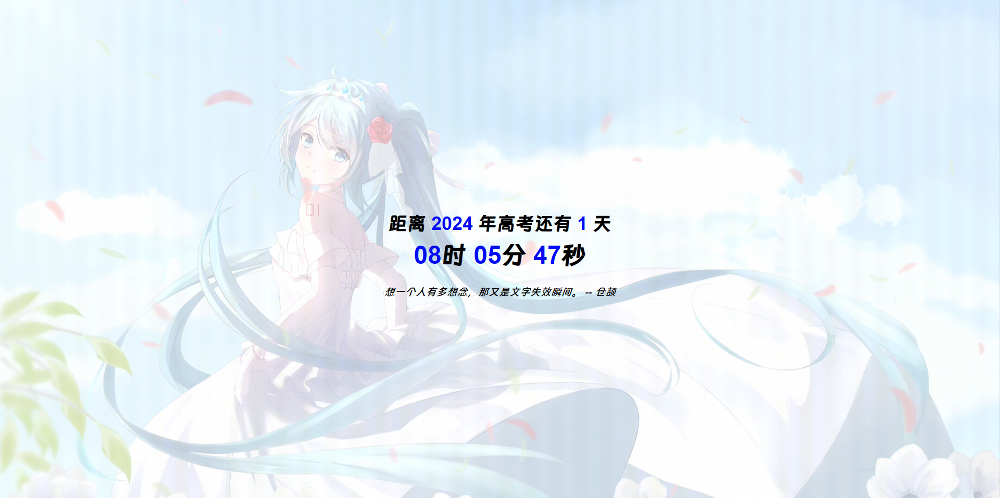
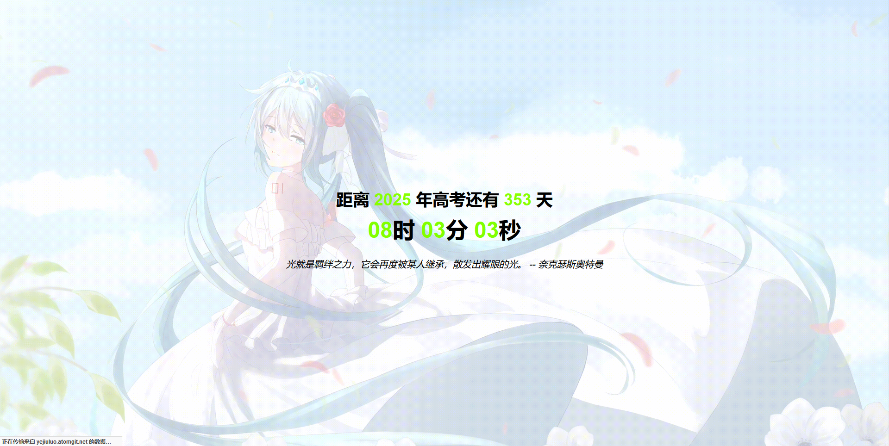

# 高考倒计时

- 显示距离高考的剩余天数
- 动态更新时间
- 简洁的用户界面

今年的高考过后，自动切换到下一年。详见下方运行示例图。

示例站点：[https://blog.xingchencloud.top/gkdjs.html](https://blog.xingchencloud.top/gkdjs.html)

## 运行示例

1、平时正常倒计时的样子。

2、高考中（一般为每年的6月7、8、9日）则显示为这个样子。

3、当今年的高考结束后（6月10日开始），则自动切换为下一年的高考倒计时。

# 修改使用

1. 可自行调节 文字是否动态取色，见 `gk.js` 里面的 `const useDynamicColor = true;`

2. 可选择调用本地时钟或者调用时钟服务器作为倒计时时间，还是 `gk.js` 里面的 `const useLocalTime = false;`

3. 背景也可以自行更改，见 `gk.css` 里面的 `background-image: url('https://api.paugram.com/bing');` 这里默认使用保罗的Bing每日壁纸API。

如果遇到突发情况（比如前几年新冠）导致高考时间调整，可自行更改相关代码。本代码可以直接编辑保存后在浏览器打开查看，也可以自己部署到服务器绑定域名随时查看，如果您是老师，可以将其作为班级教学电脑桌面壁纸。

## 贡献

欢迎贡献！请提交拉取请求。

## 致谢以下项目

随机一言功能基于 <a target="_blank" href="https://hitokoto.cn/">一言</a> API 实现。Bing每日壁纸背景由 <a target="_blank" href="https://api.paugram.com/help/bing">保罗</a> 提供。

## 许可证

> MIT License
>
> Copyright (c) 2024 星尘
>
> Permission is hereby granted, free of charge, to any person obtaining a copy
> of this software and associated documentation files (the "Software"), to deal
> in the Software without restriction, including without limitation the rights
> to use, copy, modify, merge, publish, distribute, sublicense, and/or sell
> copies of the Software, and to permit persons to whom the Software is
> furnished to do so, subject to the following conditions:
>
> The above copyright notice and this permission notice shall be included in all
> copies or substantial portions of the Software.
>
> THE SOFTWARE IS PROVIDED "AS IS", WITHOUT WARRANTY OF ANY KIND, EXPRESS OR
> IMPLIED, INCLUDING BUT NOT LIMITED TO THE WARRANTIES OF MERCHANTABILITY,
> FITNESS FOR A PARTICULAR PURPOSE AND NONINFRINGEMENT. IN NO EVENT SHALL THE
> AUTHORS OR COPYRIGHT HOLDERS BE LIABLE FOR ANY CLAIM, DAMAGES OR OTHER
> LIABILITY, WHETHER IN AN ACTION OF CONTRACT, TORT OR OTHERWISE, ARISING FROM,
> OUT OF OR IN CONNECTION WITH THE SOFTWARE OR THE USE OR OTHER DEALINGS IN THE
> SOFTWARE.
